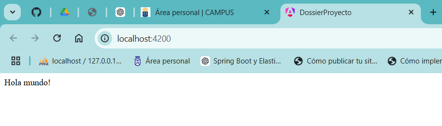
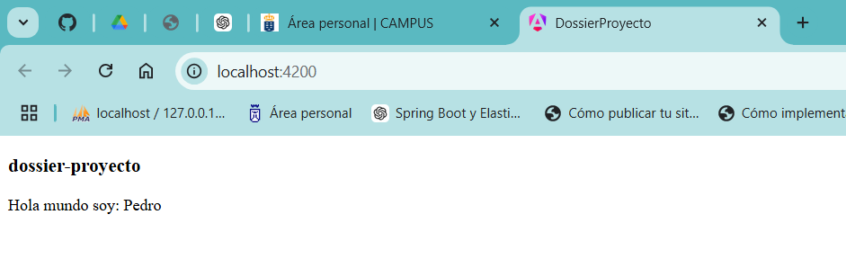
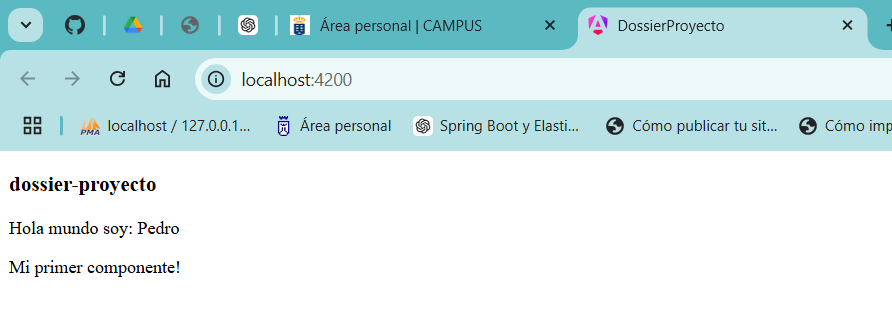
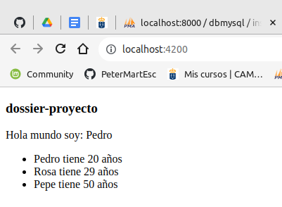

<div align=justify>

# Dossier - Angular

En este dossier realizaré las practicas del pdf aportado por el profesor para aprender a trabajar con Angular.
Todas las prácticas realizadas, serán adjuntadas en un zip del proyecto, junto con este pdf.

Para lanzar el proyecto:

```bash
    ng serve -o
```

### Práctica 1

Crear un proyecto llamado: nombrealumno-practicas-angular
Ir al fichero: app.component.html borrar el contenido y escribir el clásico hola mundo:
hola mundo!.



### Práctica 2

Modificar los dos ficheros de la forma descrita en la imagen para que aparezca
el nombre y el título en el html




### Práctica 3

Crear el componente descrito y cargarlo con el selector en app.component.html



### Práctica 4

Crear el componente gente y cargarlo con el selector en app.component.html
Ese componente tendrá creado un array con datos de personas ( nombre y edad )  Se debe 
mostrar el listado de personas, una persona por fila de la tabla



### Práctica 5

### Práctica 6