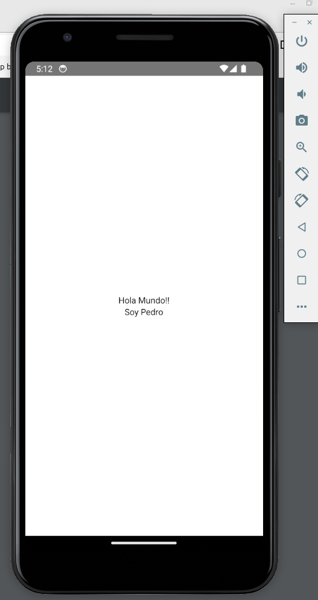

<div align=justify>

# Dossier - ReactNative

En este dossier realizaré las practicas del pdf aportado por el profesor para aprender a trabajar con ReactNative, en las que se especifique alguna __pregunta__ o pida __capturas__ de demostración de funcionamiento. 

Todas las prácticas realizadas, serán adjuntadas en un zip del proyecto, junto con este pdf.

Para lanzar el proyecto:

```bash
    npm start
```

> Luego deberemos escoger la `a` para lanzarlo en Android

Todas las practicas estan comentadas en `App.tsx`, solo hay que descomentar la que se quiera visualizar.

### Practica 1

> Crearemos un: “hola mundo!. Soy nombrealumno”
Para ello vamos a App.tsx. Dejaremos únicamente un componente View ( que es el
contenedor habitual en react native ) y pondremos dentro un componente Text ( que es
donde escribiremos ) Practica con tus conocimientos de CSS
Tener en cuenta que la mayoría son válidos, únicamente cambiando la separación con
guiones por camel case, y pasando un objeto JSON a style. Así por ejemplo, si queremos
hacer que el view ocupe todo en color rosa y ubique su contenido en el centro de la
pantalla:   <View style={{ backgroundColor: "lightpink", flex: 1, justifyContent: 'center' }}>

```
    practias/pr01
```



### Practica 2

Reproducir el código anterior. Cambia el color del borde, redondea un poco el
borde ( busca la propiedad, es muy parecida a CSS ) y pon otro color de fondo. Modifica
también para que aparezcan dos botones. Uno será para incrementar ( el botón dirá:
“incrementar” ) y otro botón para decrementar. 

```
    practias/pr02
```


### Practica 3

Crear la estructura de carpetas que hemos nombrado y un componente:
InicioScreen que será el que contenga la pantalla con los botones y el contador. En
App.tsx se hará la llamada a: <InicioScreen /> Los estilos deberán separarse usando
StyleSheet.create() 

```
    practias/pr03
```


### Practica 4  

Realizar la pantalla anterior siguiendo lo descrito ( poner un width y un height 
de 100 en el style del componente Caja.tsx ) . Para que el View “escenario” ocupe el total, 
poner en sus estilos la propiedad: flex: 1  


### Practica 5  

Si en el componente: Caja.tsx ponemos 2 botones, uno
para incrementar el valor de flex y otro para decrementarlo, podremos ir
viendo el efecto de modificar dicho atributo en cada una de las tres
cajas.  Agregar los dos botones y que el dato que se muestra: flex: 0 se
actualice según las pulsaciones de esos botones, implicando cambios en
el atributo flex correspondiente 


### Practica 6  

Sustituir los botones por un objeto TouchableHighlight para
el botón: flex+1   que cuando se puse abra una alerta e incremente la
propiedad flex, y un objeto TouchableOpacity para el botón: flex-1  que
decremente la propiedad flex
Personalizar los estilos de esos dos objetos


### Practica 7 

Obtener el renderizado anterior, consiguiendo enviar mediante props, tanto el 
nombre de la Caja.tsx como estilos personalizados que sobreescriban/agreguen a los que 
estén por defecto (observar que Caja B tiene bordes redondeados )


_(Nota: Incompleta)_

### Practica 8  

Obtener el renderizado anterior, empezando por no tener ningún círculo. A
medida que se pulsa el botón: Agregar Círculo, irán apareciendo. Observar que los colores
van variando progresivamente. Se empieza con un: rgb(red,green,blue) y según el número
de id que corresponda va variando un poco más ( tener en cuenta que los colores van de 0
a 255 no se puede superar )   Los dos botones cambian entre: wrap /nowrap     y entre:
column/row. El renderizado que se muestra tiene: flexDirection: ‘row’, flexWrap: 'wrap'.
Observar que dos de los botones tienen estilos, así que no usaremos  Button con ellos. Se
propone TouchableOpacity


### Practica 9  

Obtener renderizado parecido al anterior. Las imágenes pueden ser otras.
Debe   funcionar   el   onChangeText   para   cambiar   justifyContext   y   los   botones   para
alignContext. Una de las imágenes se guardará en una carpeta: img  y se cargará con:
require().  
Cuidado! NO poner wrap. Debemos establecer nowrap, o al hacer aignItems se ubicará
según  el   tamaño   del   objeto   más   grande   de   la   columna,   en  lugar   de  respecto   a  su
contenedor


### Practica 10 

Hacer la calculadora descrita


### Práctica 11

Hacer un hook personalizado para la calculadora que tenga todo el código que
está fuera del return del componente


_Nota:_ se encuentra dentro de la carpeta de la Pr10 


### Practica 12  

Reproducir el ejemplo anterior, generando una pantalla específica, pero le
haremos algunas diferencias. El botón dirá: “cambiar de color” entonces se genera un
color aleatorio a mostrar ( puede ser de un array previamente generado de colores:
“gray”, “blue”,... ) y se le muestra una alerta al usuario diciendo cuál es el color que se va
a poner de background de la pantalla. Si pulsa ok se cambia el fondo, si pulsa cancel se
mantiene el previo 


### Practica 13 

Usar el prompt descrito para recrear  el ejercicio anterior del color de fondo. 
Ahora en lugar de una alerta se mostrará un prompt para que el usuario introduzca un color 
de fondo en lugar de uno aleatorio.
Nota: es posible que de error si se instala con la app ya lanzada. En ese caso parar metro y 
volver a lanzar

_Nota: incompleta_

### Practica 14 

Reproducir el ejemplo anterior, poniendo en el pulsador ( la bola ) los
colores si falso: brown, si verdadero: orange       No aplicar los otros dos colores del
ejemplo El switch debe valer para poner un borde a toda la pantalla de color rojo o
quitarle el borde


### Practica 15 

Reproducir el ejemplo anterior, completando lo que falta (poniendo el switch 
de: casado )


### Practica 16  

Reproducir el ejemplo anterior, reemplazando el array de personas por uno
de productos donde se quiere ver el nombre del producto, el precio y el stock. No debe
haber separador. Dale un estilo personalizado a los items ( observa que en cada item
viene un atributo index ) y muestra un color de fondo para los items impares y otro
distinto   para   los   pares.   Pon   centrado   y   más   grande   la   cabecera   y   que   diga:   Lista
Productos


### Practica 17 

Basándose en el ejemplo de formulario que hemos hecho, vamos a realizar
ejercicio de cálculo de imc.  Estará el componente:  CardPersona.tsx   que contendrá el
formulario para imc (id, nombre, altura, peso )  y el componente padre que mostrará la
lista de cards una debajo de otra. Habrá un botón con title: “+”   para crear cada nuevo
CardPersona. Habrá en cada card un botón para poder borrar la persona de la lista
Nota: observar que en el padre únicamente se precisa el tamaño del array ( que se obtiene
al pulsar el botón y además genera el id que se pasa por props). Así que modificar el state
de la card no tiene por qué modificar el state de la lista de cards. Otra cosa es el botón
eliminar, que sí debe afectar al state del apadre.


### Practica 19 

Conversor de iconos smiles a texto. Esta otra pantalla tiene en la parte
superior   varios   iconos   (   uno   para   sonrisa,   otro   para   tristeza,   etc   )   El   usuario   va
escribiendo en un TextInput un texto y quiere agregar en formato texto el smile. Para que
no tenga que conocerlo, basta que en ese momento pulse en el icono correspondiente y le
aparecerá agregado al final de su texto, el texto smile correspondiente


### Practica 20  

Reproducir el anterior ejemplo de Stack.Navigator con HomeScreen


### Practica 21  

Reproducir el anterior ejemplo con tres Screen en el navigator. Poner un
TextInput en   PrimeraScreen para que el usuario introduzca un nombre. Cuando el
usuario pulse el botón que lo lleva a TeceraScreen, el texto introducido en el TextInput se
envía como parámetro a TerceraScreen y allí dira: “Saludos nombreusuario. Bienvenido!”
Como sabemos, intentamos dejar nuestro componente App.tsx bastante limpio. Crear un
nuevo componente: src/navigation/StackNavigation.tsx  y trasladar todo el código de la
navegación.  


### Practica 22 

Reproducir el anterior ejemplo con dos Screen en el navigator. Cambiar el
color de fondo del header ( a uno de tu elección). Poner en blanco el color del título. Que
no se muestre el headerBack  ( establecerlo a false.Nota: según el emulador se podrá aún
regresar   arrastrando   desde   el   extremo   de   la     derecha   hacia   la   izquierda.   En   otros
emuladores quizás no se pueda regresar). Alinear el título en el centro y pon tu nombre en el título


### Practica 23  

Vamos a hacer el clásico: todo list Aparecerán   2   pantallas,   una con la lista de tareas. En cada fila del flatlist se puede pulsar sobre   el   check   y   que   quede marcada como realizada o no ( observar que si está finalizada el   texto   queda   tachado   y cambia el icono ) al hacer click sobre   el   icono   de   editar   nos lleva  a  la  segunda  pantalla  y modificamos el asunto y si está o   no   realizada.   Si   se   pulsa sobre   el   icono   de   papelera borra la tarea. El botón más: “+”   nos   lleva   a   la   segunda pantalla para crear una nuevatarea   (   los   ids   se   generanautomáticamente   y   el   usuariono los puede editar ) Buscar por: “options” en Statck.Screen allí podemos poner opciones muy similar a:screenoptions de Stack.Navigator, pero adicionalmente puede tratar con parámetros de laruta y así mostrar el id de la tarea en el títuloSe debe generar un contexto donde se guardará el state de la lista de ToDos y sucorrespondiente setter.


### Practica 24

rear   una   navegación   Drawer.   La   primera   Drawer.screen   será:
StackNavigation.tsx (así se cargará por defecto el Stack   ) y la otra: AboutScreen.tsx.
Poner   en   AboutScreen.tsx   información   tuya   (   tú   nombre,   curso,   etc   )   En StackNavigation.tsx tendremos un Stack Navigator  que apunte al menos a dos pantallas, una será una pantalla de enlaces a otras actividades del Stack, La segunda pantalla será la tarea de la calculadora ( que deberá estar enlazada en la página de enlaces ) Así desde el Drawer podemos acceer directamente a About y luego si desde el Drawer se elige el Stack podemos acceder a las otras pantallas del Stack.
Pon en la carpeta navigation tanto MenuLateral.tsx como StackNavigation.tsx

_Nota: incompleta_

### Práctica 25

Reproducir el ejemplo anterior. Girar la pantalla ¿ quéda el menú visible ? Cambiar el color de fondo del menú lateral y poner que tenga un ancho de 200. Prueba a comentar   y   descomentar   la   línea   del   drawerContent   ¿   Cuándo   lo   activas   siguen mostrándose los enlaces a las pantallas ? Vamos a personalizar el menú. 

Si, queda el menú visible, a mitad de la pantalla. Si comento la linea del drawer content, se muestra cada componente como un elemento del drawer content por defecto.


### Practica 26

Realizar la app de mascotas descrita

_Incompleta_

### Practica 27  

Crear una app con dos tabs. En una de ellas aparecerá un icono relacionado
con operaciones matemáticas y al acceder cargará un StackNavigation que en su primera
pantalla tendrá enlaces a tareas realizadas una de ellas será la calculadora
La otra tab tendrá el About.tsx que mostrará tu nombre, curso, aficiones

_Incompleta_

### Practica 28  

Aplicación Pokemon. 
Haremos una aplicación para ver datos de pokemon. Habrá
dos   tabs   y   en   cada   tab   tendremos   un   StackNavigation.   La
primera tab tiene un Stack que será para visualizar la lista de
pokemon ( usaremos un flatlist ) en la primera pantalla del Stack
y cuando se pulse sobre un pokemon se abrirá otra Screen del
Stack para ver todos los datos del pokemon ( con sus diferentes
sprites ) 
La segunda tab tiene otro Stack. En la primera de las pantallas
del Stack hay un cuadro de texto para buscar  pokemon por
subnombre ( aparecerán los pokemon que en su nombre incluyan
el texto introducido ). Cuando pulsamos sobre alguno de la lista
obtenida nos lleva a la Screen con todos los datos del pokemon.


### Practica 29  

Reproducir el ejemplo anterior. Pero en lugar de console.log aparecerá la
localización en un <Text> mediante json.stringify().   En el caso de que no se tenga
permisos   se   mostrará   que   no   los   hay.     Probar   a   conceder   o   no   el   permiso,   luego
eliminarlo, etc


### Practica 30 

Vamos a crear un historial de ubicaciones, en la actividad de permisos de
geolocalización. Vamos a modificarla de tal forma que el botón lo que haga es guardar en
asyncstorage la latitud, longitud y timestamp ( se debe mantener que si no hay permisos
se soliciten ) Al pulsar en el botón se informará en un <Text> de que se ha guardado y la
posición que ha guardado. Habrá otro botón que se llamará “historial” que al pulsarlo lee
del asyncstorage la lista de posiciones guardadas y las muestra en un <Text>


_Casi del todo_

### Practica 31 

Hacer la actividad descrita. Cuando arranque la aplicación y se muestre la
primera pantalla poner modo avión cerrar la aplicación y volver abrir. Hacer click en
alguna de las noticias. Si todo está bien cargará la noticia del async storage y la mostrará

_Incompleta_

### Practica 32  

a) Reproducir el ejemplo anterior ( usar únicamente la clase Persona no
hace falta la otra clase ) 
b) Poner dos textinput. Uno para la edad y otro para el nombre. Ahora al pulsar en el
botón, en lugar de datos aleatorios, se creará en la base de datos la persona introducida
por el usuario


### Practica 33 

En la actividad del TodoList vamos a persistir en base de datos, y así una
vez cerremos la aplicación y la volvamos a abrir se mantendrá la información de las
tareas
Podemos utilizar el tipo boolean en TypeORM: @Column('boolean') completada: boolean;
Para decir si se completó el todo. Observar que para evitar errores, cuando corresponda
el update y el delete de la tarea, mejor usar el id como condición


### Practica 34  

Vamos a crear una actividad que emule una tienda de productos de comida.
Tendremos tabs y en una de las tabs introducimos los productos (nombre, precio, stock y
un boolean: descontinuado ) En la segunda tab hay un cuadro de texto para subnombre,
otro para precio menor que el número dado y otro para precio mayor qué el número dado
y un switch para elegir si ordenamos por nombre ascendente ( si el switch está a false no
ordena )


_Incompleta pero cumple su función_

### Practica 35  

Continuamos con la tienda. Crearemos una entidad categoría y tendremos
un tab para introducir las categorías. Poner ya las relaciones Si hay problema con los
datos almacenados recreamos la base de datos desde cero ( basta cambiar el nombre de la
database y ejecutar:  npx react-native start --reset-cache. 
No nos preocuparemos ahora de como guardar el producto con la categoría vinculada

_Incompleta_

### Practica 36  

Continuamos con la tienda. Ahora en la tab para crear producto hay un
input para poner el nombre de la categoría y ya debe funcionar la relación bien

_Incompleta_

### Practica 37  

Hacer otra tab en la actividad de la tienda donde se muestren las categorías
en un FlatList y por cada categoría haremos un JSON.stringify() que permita ver los
productos que tiene cada categoría

_Incompleta_

### Practica 38  

Reproducir el ejemplo anterior en un ejercicio aparte. Habrá varios tabs.
Uno   para   introducir   propietarios.  Otro   para   introducir   casas   y   una  tercera   tab   para
vincular un propietario con una casa. En una cuarta tab se mostrará en un  FlatList   los
propietarios con JSON.stringify y debe aparecer la información de sus casas

_Incompleta_

### Practica 39 

Crear otra pestaña donde se puede poner en un input el id del propietario y
en el otro la referencia catastral de la casa y que al pulsar en el botón: borrar  se elimine
el vínculo entre los dos objetos en la base de datos

_Incompleta_

### Practica 40

Reproducir el ejemplo anterior con la app de propietarios-casas. De tal
forma que se pueda guardar un array de casas protegido por una transacción. Llamaremos
al método del repositorio: saveAtOnce( casas: Casa[] )

_Incompleta_

</div>